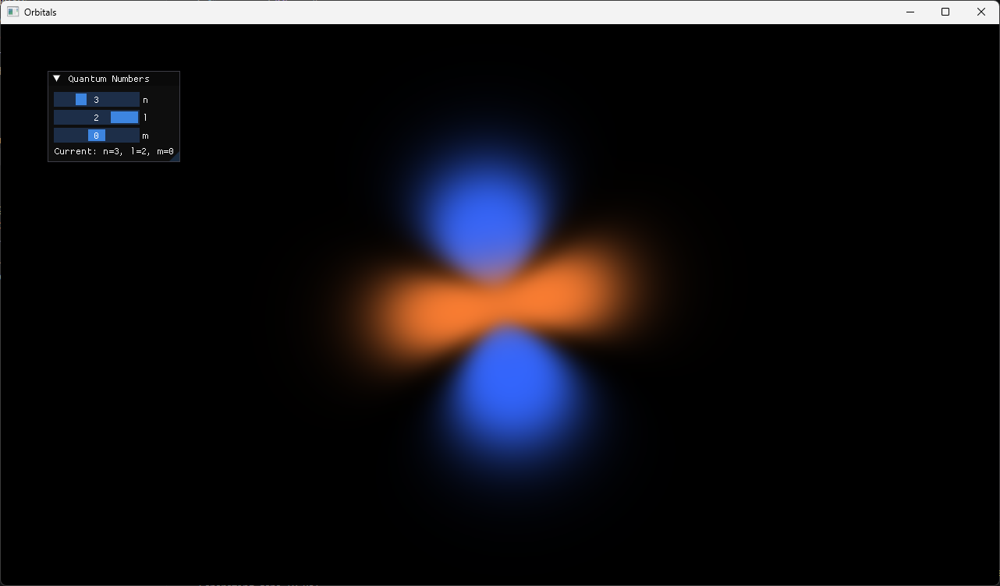
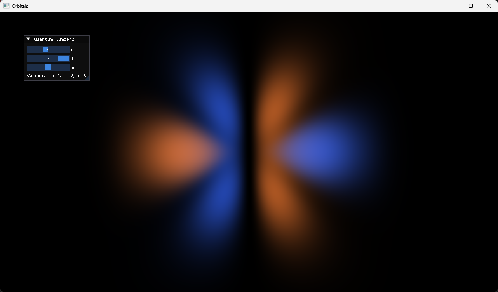
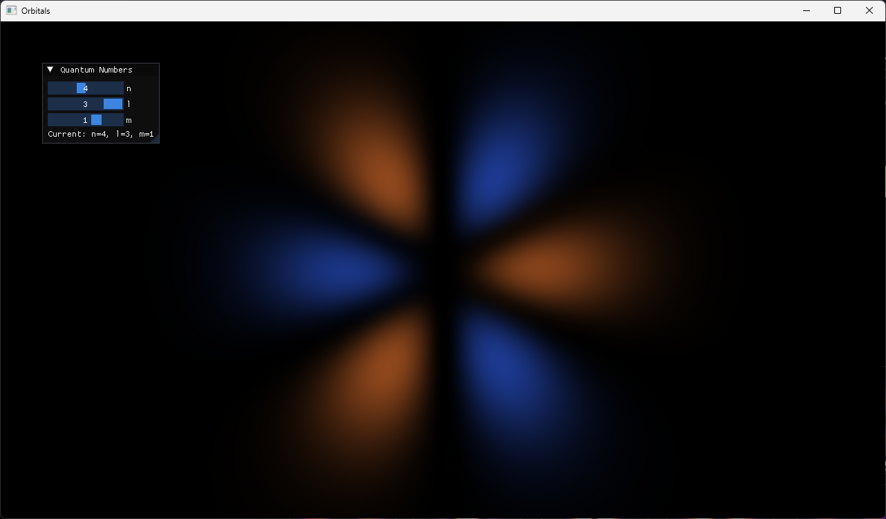
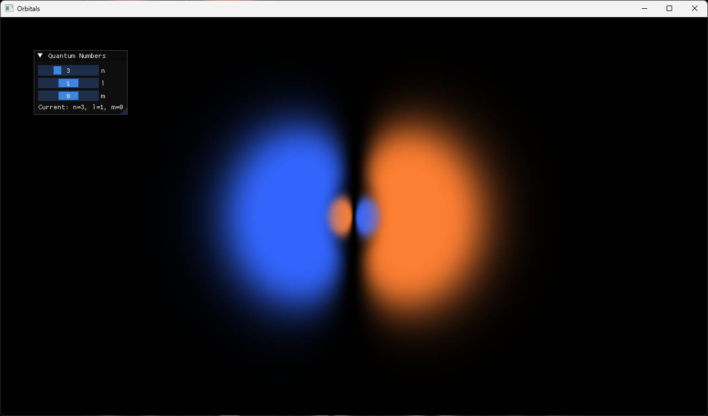

# Orbitals

## Preview






Orbitals generates a fragment shader from quantum numbers, renders the result with OpenGL, and lets you rotate the view in a small ImGui-based UI.

## Requirements

- CMake 3.20+
- A C++20 compiler (MSVC, clang, or GCC)
- Git (required by CMake FetchContent to download dependencies)
- OpenGL 3.3 compatible GPU driver

## Build (Windows, PowerShell)

```powershell
cmake -S . -B build -G "Visual Studio 17 2022"
cmake --build build --config Release
```

## Run

```powershell
./build/Release/orbitals.exe
```